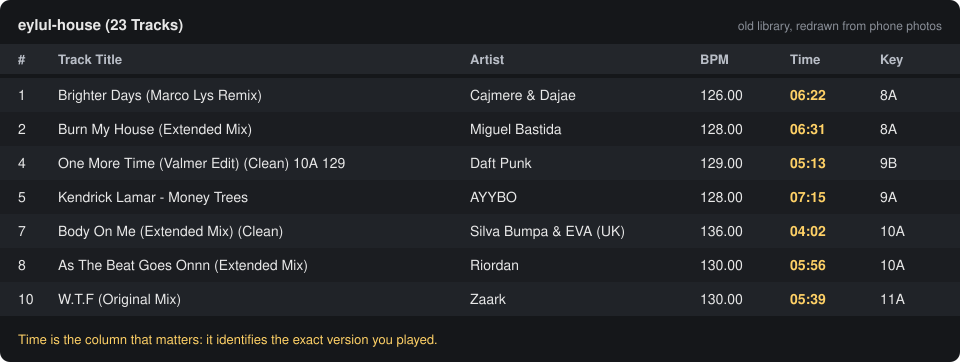

# DJ Archivist

An AI skill for DJs. It builds and maintains a clean, mix-ready track archive, plans sets,
coaches mixing, and knows its way around electronic music.

> **Disclaimer.** This project is provided as is, for educational and personal archival
> use. It does not host, index or distribute music. You alone are responsible for how you
> use it and for complying with copyright law and the terms of any network or service you
> connect it to. The author accepts no liability for any use or misuse. Read the full
> [DISCLAIMER](DISCLAIMER.md) before using it.

## Why

A DJ library breaks in boring ways:
- the laptop dies;
- files come without backups;
- the "Extended Mix" you grabbed turns out to be a different edit;
- a 128 kbps rip sneaks in as a 320;
- tags are full of shop spam;
- the same track sits in five folders with five sets of cue points.

DJ Archivist is a set of instructions, references and scripts that lets an AI assistant
(built for [Claude Agent Skills](https://docs.anthropic.com/en/docs/agents-and-tools/agent-skills))
fix that patiently and carefully, the way a meticulous record-shop clerk would.

## What it does

**Archive Builder**
- Turns old library screenshots, playlist exports or loose notes into a tracklist
  (artist, title, version, length, BPM, key, playlists).
- **Length is the version.** It identifies the exact version you played by its length,
  not by what the filename claims. With no reference it trusts a length only when
  independent sources agree and at least one names the version; anything ambiguous is
  parked for a decision instead of guessed.
- Format policy: MP3 only at 320 kbps CBR, otherwise lossless (AIFF, FLAC, WAV). Size-based
  estimates rule out wrong versions and low bitrates before downloading; ffprobe verifies
  every file after. Suspected upsampled files get a "listen" note.
- Sources: your own files and backups, store links for what you should buy, and an
  optional Soulseek backend through [slskd](https://github.com/slskd/slskd) for material
  you are entitled to obtain. The backend is paced, respects bans and quotas, tracks every
  transfer and falls back to the next valid file when a peer refuses.
- One file per track, filed into your playlist tree; clean artist/title tags written with a
  stream copy (audio untouched, checksum verified).
- A Rekordbox XML with your whole playlist tree, an archive index CSV and a generated README,
  all kept current automatically.
- An **inbox file**: write loose track names under headings like `House:` or `Heard at
  that party:`. The assistant resolves the real release and the mixable version, then
  adds it. When the track lands, ` - DOWNLOADED` is appended to its line, so you can follow
  progress without opening any tool.

**Set Architect.** Plateau, hump or arc structures; Camelot sequencing; BPM bands; vocal
placement; a mixing sheet with a transition plan per pair.

**Mixing Coach.** A teaching ladder from EQ swaps to drop swaps, with exact controller
steps (examples for the Pioneer DDJ-FLX4), drills and self-checks.

**Genre and Theory Guide.**
- Genres from house and UK garage to techno, trance and drum and bass: BPM ranges,
  arrangement and what mixes with what.
- Version names and what each means for a DJ.
- Phrasing, the Camelot wheel, keylock, EQ bands, gain staging, loudness and file quality.

**Set Renderer.** A finished mix plus a photo or video loop becomes a `.mov` with
bit-for-bit lossless PCM audio, ready for upload.

## A real walkthrough

This is how one DJ's library came back after it was lost. Everything that survived was a set
of phone photos of the old DJ software screen. The numbers below are from that run.

**1. You: capture what is left.** Photos or screenshots of your old library, with the Title,
Artist, BPM, Time and Key columns visible. Or a playlist export.



*(Redrawn for this README; the original photos are not published.)*

**2. The assistant reads them into a tracklist.** Time is the column that matters: it
identifies the exact version you played. 193 tracks were read from 11 photos. Two checks
confirmed every reading:
- tracks that appear in several playlists showed the same values everywhere;
- the playlist totals the software prints under each list matched the sum, to the minute.

```csv
id,artist,title,length,bpm,key,playlists
2,Miguel Bastida,Burn My House (Extended Mix),06:31,128.00,8A,eylul-house; Groovy Tech House
5,AYYBO,Kendrick Lamar - Money Trees,07:15,128.00,9A,eylul-house; Ayybo Exclusif
7,Silva Bumpa & EVA (UK),Body On Me (Extended Mix) (Clean),04:02,136.00,10A,eylul-house; UKG House
```

**3. You: set up the tools once** (see "What you have to do yourself" below). Then
`archivist.py start`.

**4. The loop finds the right version, patiently.** Real cases from that run:

| Track | What was on the network | What happened |
|---|---|---|
| Money Trees (AYYBO edit) | Two versions, 7:00 "Extended Edit" and 7:15 "Extended Edit v2": nearly the same label | The old library said 7:15, so only 7:15 files were candidates |
| Body On Me | Titled "(Extended Mix)", but the old file was 4:02 | "Take the longest" would have picked a different edit; length picked the right one |
| Brighter Days (Marco Lys Remix) | First peer answered "Too many megabytes" | Next peer 16 seconds later: MP3 320, 6:22 |
| Money Trees, again | The 7:15 MP3 320 sat behind a queue of 11,468 people; the free FLAC's owner answered "Banned" (you share nothing) | Queue released after 10 minutes, banned peer never retried, a WAV from a third peer landed at 7:15 |
| Riordan, As The Beat Goes Onnn | First search returned nothing (Soulseek is inconsistent) | The next query variant found it: MP3 320, 5:56 |

**5. The archive fills up.**
- **Folders:** the old playlist tree (`2026/UKG House`, `Groovy Tech House`, `House`...),
  one file per track.
- **Tags:** clean artist/title; shop-spam tags removed.
- **Kept current automatically:** a `rekordbox.xml` with every playlist membership, an
  `archive-index.csv` and a README.

In the first afternoon, about 100 tracks came back, each matching the old library's length.

**6. New tracks go in the inbox.** You write loosely:

```text
House:
mochakk - Jealous
franky rizardo - faith
mant - Provenance
```

The assistant resolves each line before anything is downloaded:

| You wrote | Resolved | Why this version |
|---|---|---|
| mochakk - Jealous | Mochakk - Jealous (Extended Mix), 5:45 | 61 sources agree on 5:45 with an "Extended" label; the 4:16 radio edit was ruled out |
| franky rizardo - faith | Franky Rizardo - Faith (Extended Mix), 4:59 | Two different "Extended" lengths were in circulation (4:59 in 9 sources, 5:47 in 6); the 4:59 files carried the store's key and BPM (1A, 130). Picked, and flagged "listen" |
| mant - Provenance | MANT, Todd Edwards - Provenance (Original Mix), 6:41 | The loose name missed the collaborator; the 3:39 short mix and a 6:11 remix were ruled out |

When each track lands, its line is marked, and you never have to open a tool to know:

```text
House:
mochakk - Jealous - DOWNLOADED
franky rizardo - faith - DOWNLOADED
mant - Provenance - DOWNLOADED
```

## What you have to do yourself

The assistant prepares and runs everything it safely can. These steps are yours:

1. **Install the tools:** `ffmpeg` (for example `brew install ffmpeg`, or a static build;
   set `ffmpeg_dir` in the config if it is not on your PATH) and, if you want the Soulseek
   backend, [slskd](https://github.com/slskd/slskd).
2. **Log in to Soulseek yourself.** Run `python3 skill/dj-archivist/scripts/slskd_setup.py`
   in your own terminal and type your Soulseek username and password when it asks. A new
   username is registered on first login. The assistant never types, sees or stores your
   password; it lives only in your local slskd config (file mode 600).
3. **Decide what you share.** Many peers refuse users who share nothing. Share only music
   that may be redistributed, for example Creative Commons netlabel releases kept with their
   license files, or your own productions. Never share your archive.
4. **Provide the source material:** photos or exports of your old library, and your inbox
   lines.
5. **Keep the machine awake** while the loop runs, and keep the assistant app open for
   scheduled routines. Approve the tool permissions the first time a routine runs.
6. **Use your ears:** listen to tracks flagged "listen" (possible upsampled files, competing
   versions) and answer the assistant when an inbox line is ambiguous.
7. **Buy what cannot be found.** Tracks that exhaust every retry end up on a `not_found`
   list with store links.
8. **Import into Rekordbox** when a batch lands:
   1. Preferences > View > Layout: enable "rekordbox xml".
   2. Preferences > Advanced > Database > rekordbox xml > Imported Library: choose the
      archive's `rekordbox.xml`.
   3. Right-click the folders under rekordbox xml > Import Playlist.

## Troubleshooting

- **Searches return nothing for a while.** Soulseek throttles busy accounts. The loop
  notices (a canary search for a common term also comes back empty), pauses for 15 minutes
  and does not count those rounds. Just wait.
- **Big artist names never return results.** Some names are blocked server-side. The loop
  searches by the remixer or by title keywords instead.
- **slskd crashes** (`OutOfMemoryException` about threads, or "Too many open files").
  Broad queries return thousands of files at once. The loop narrows queries without an
  artist word and restarts slskd if it dies. If it keeps happening, start slskd with a
  higher open-files limit (`ulimit -n 10240`).
- **A peer answers "Banned" or "Too many megabytes".** That is the peer's rule, usually
  aimed at users who share nothing. The loop never retries a ban, skips a quota for 24
  hours and moves on to the next valid file.

## Repository layout

```
docs/images/                     README illustrations
skill/dj-archivist/
  SKILL.md                       the skill: modes, principles, routines
  references/
    archive-method.md            the archive rules in full
    version-decisions.md         how to decide between versions
    set-building.md              set planning method and mixing sheet format
    transitions-and-effects.md   coaching ladder and effect taste rules
    edm-genres.md                genre field guide and version names
    music-theory-for-djs.md      phrasing, keys, EQ, loudness, file quality
  scripts/
    archivist.py                 the archive loop and CLI
    slskd_setup.py               optional slskd (Soulseek) setup helper
    render_set.py                lossless set-to-video renderer
  templates/                     example config, tracklist and inbox
tests/                           offline tests for the archive logic
```

## Requirements

- An assistant that supports Agent Skills (Claude Code, or the Claude apps with skills
  enabled).
- Python 3.9 or newer (standard library only).
- `ffmpeg` and `ffprobe`.
- Optional: [slskd](https://github.com/slskd/slskd) and a Soulseek account, if you choose to
  use that backend.

## Install

**Claude Code:** copy the skill folder into your skills directory:

```bash
cp -R skill/dj-archivist ~/.claude/skills/
```

**Claude apps:** zip the `skill/dj-archivist` folder and upload it under
Settings > Capabilities > Skills.

## Quick start

1. Copy `templates/config.example.json` to `~/.dj-archivist/config.json` and set:
   - your archive folder, working folder and inbox file;
   - your playlist tree;
   - your format priority.
2. Build a tracklist CSV from `templates/tracklist.example.csv`. Or ask the assistant to
   build it from screenshots of your old library; the Time column is the most valuable
   field.
3. Bring in what you already own:

   ```bash
   python3 skill/dj-archivist/scripts/archivist.py import-local --dry-run
   ```

4. Optional backend: `python3 skill/dj-archivist/scripts/slskd_setup.py` (you type your
   credentials; they are stored only in your local slskd config).
5. Start the loop:

   ```bash
   python3 skill/dj-archivist/scripts/archivist.py start
   python3 skill/dj-archivist/scripts/archivist.py status
   ```

6. Ask the assistant for a daily routine: it keeps the loop alive, resolves your inbox,
   decides parked versions and reports what landed.
7. Import `rekordbox.xml` from your archive folder into Rekordbox (steps in the generated
   README inside the archive).

Run the tests with `python3 tests/test_core.py`.

## Responsible use

- **Buy the music you play.** Artists and labels live on it. Beatport, Bandcamp,
  Traxsource, Juno and label shops are one search away, and the assistant will point you
  there for anything you do not already own.
- **Only obtain files you have the right to:** your purchases and promos, your own
  backups, your own productions, and works licensed for redistribution.
- **Share only content that may be redistributed** (for example Creative Commons music with
  its license). Never share purchased or downloaded commercial music. In several countries,
  sharing on peer-to-peer networks draws warning letters and fines.
- **Be a good peer.** The loop is deliberately slow: it paces searches, limits concurrent
  transfers and never retries a peer that refused you.

## License and disclaimer

Code and documentation are released under the [MIT License](LICENSE). Use of this project is
subject to the [DISCLAIMER](DISCLAIMER.md): you are solely responsible for your use of it,
and the author accepts no responsibility or liability of any kind.
